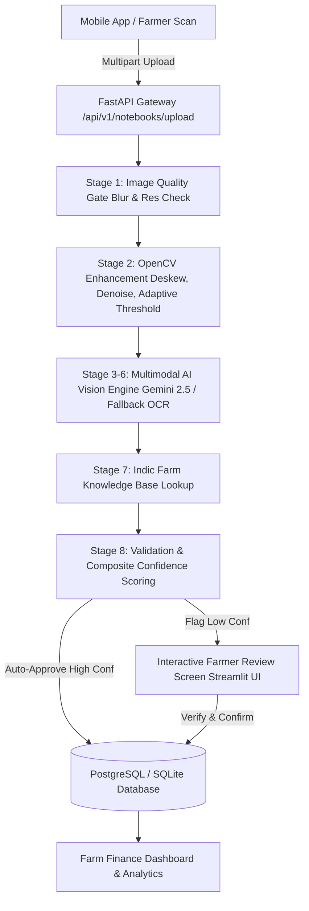

# 🌾 GramIQ AI Ledger Digitization System

[](https://www.python.org/)
[](https://fastapi.tiangolo.com/)
[](https://opencv.org/)
[](https://streamlit.io/)
[](LICENSE)

An end-to-end **AI Document Intelligence Platform** purpose-built for Indian agriculture. It converts handwritten, multilingual paper notebooks (**Bahi-Khata**) into structured, machine-readable financial ledgers using computer vision, Indic domain knowledge base mapping, and vision LLMs.

---

## 🌟 Key Features

- **Multilingual Handwriting Recognition**: Supports mixed Hindi Devanagari, Marathi, and English handwritten ledger entries on the same page.
- **8-Stage AI Digitization Pipeline**: Automated image quality gate, OpenCV deskewing & shadow removal, layout parsing, Indic agricultural domain enrichment, and arithmetic sanity checks.
- **Indic Farm Knowledge Base**: Native resolution of local product names, aliases, and labor tasks (e.g. *मजुरी*, *निंदणी*, *बियाणे*, *DAP*, *यूरिया*, *नांगरटी*) to standard accounting categories.
- **Confidence-Driven Human Review**: Automatic confidence scoring (`High`, `Medium`, `Low`). High-confidence records are auto-committed, while low-confidence entries are flagged for farmer review.
- **REST APIs for Mobile & Web**: Clean FastAPI REST endpoints ready for Flutter / native mobile app integration with CORS enabled.
- **Interactive Streamlit Demo App**: Multi-tab web application featuring real-time image scanning, interactive farmer verification grid, and crop-wise P&L analytics dashboards.

---

## 🏗️ System Architecture



---

## 🚀 Quickstart Guide

Follow these steps to run the FastAPI backend server and Streamlit demo UI on your local machine.

### Prerequisites
- **Python 3.10+**
- **pip** and **git**

---

### Step 1: Clone the Repository
```bash
git clone https://github.com/GramIQ/Finance-OCR.git
cd Finance-OCR
```

---

### Step 2: Set Up Virtual Environment

```bash
# Create virtual environment
python -m venv venv

# Activate on Windows (PowerShell):
.\venv\Scripts\Activate.ps1

# Activate on Linux/macOS:
source venv/bin/activate
```

---

### Step 3: Install Dependencies

```bash
# Install backend dependencies
pip install -r backend/requirements.txt

# Install frontend dependencies
pip install -r frontend/requirements.txt
```

---

### Step 4: Environment Configuration (Optional)

Copy `.env.example` to `backend/.env`:
```bash
cp .env.example backend/.env
```

If you have a Google Gemini API Key for live multimodal vision extraction:
```env
GEMINI_API_KEY="your-gemini-api-key-here"
```
*(Note: If no API key is provided, the system seamlessly uses its built-in offline fallback parser with full functionality for demo purposes).*

---

### Step 5: Start the FastAPI Backend Server

```bash
cd backend
python -m uvicorn main:app --reload --port 8000
```
- 🌐 **REST API Server**: `http://127.0.0.1:8000`
- 📖 **Interactive OpenAPI Docs (Swagger UI)**: `http://127.0.0.1:8000/docs`

---

### Step 6: Start the Streamlit Demo Application

Open a new terminal window, activate your virtual environment, and run:
```bash
cd frontend
python -m streamlit run app.py
```
- 🎈 **Streamlit Demo UI**: `http://localhost:8501`

---

## 📂 Project Structure

```
Finance OCR/
├── backend/
│   ├── app/
│   │   ├── api/v1/
│   │   │   ├── endpoints/
│   │   │   │   ├── notebooks.py       # Notebook upload & process endpoints
│   │   │   │   ├── transactions.py    # Verification & editing endpoints
│   │   │   │   ├── analytics.py       # P&L and category summary endpoints
│   │   │   │   └── knowledge_base.py  # Indic KB term search endpoint
│   │   │   └── router.py              # Aggregated v1 API router
│   │   ├── core/
│   │   │   ├── config.py              # App settings & env loader
│   │   │   └── database.py            # SQLAlchemy engine & session maker
│   │   ├── models/                    # DB Tables (Notebook, Transaction, KnowledgeItem)
│   │   ├── schemas/                   # Pydantic validation schemas
│   │   └── services/
│   │       ├── image_processor.py     # OpenCV quality check & enhancement
│   │       ├── farm_knowledge_base.py # Indic domain dictionary & bounds
│   │       ├── llm_parser.py          # Gemini 2.5 Vision & fallback OCR
│   │       ├── validation_engine.py   # Arithmetic & date normalization rules
│   │       └── pipeline_orchestrator.py # 8-Stage workflow coordinator
│   ├── tests/                         # Automated Pytest suite
│   ├── main.py                        # FastAPI application entrypoint
│   └── requirements.txt
├── frontend/
│   ├── sample_images/                 # Built-in synthetic Bahi-Khata ledgers
│   ├── app.py                         # Multi-tab Streamlit web app
│   ├── generate_sample_images.py      # Sample ledger image generator
│   └── requirements.txt
├── docs/                              # Technical Design Document & Deep Research
├── .env.example                       # Environment template
├── .gitignore                         # Git ignore rules
├── LICENSE                            # MIT License
└── README.md
```

---

## 📑 API Reference Overview

| Method | Endpoint | Description |
| :--- | :--- | :--- |
| `POST` | `/api/v1/notebooks/upload` | Upload a notebook page image (multipart/form-data) |
| `POST` | `/api/v1/notebooks/process/{id}` | Execute the 8-stage AI digitization pipeline |
| `GET`  | `/api/v1/notebooks/{id}/transactions` | Fetch extracted transactions for a notebook |
| `POST` | `/api/v1/transactions/verify` | Submit farmer reviews & verify transactions |
| `GET`  | `/api/v1/analytics/summary` | Get aggregated P&L, category cost, & crop summaries |
| `GET`  | `/api/v1/knowledge-base/search` | Query regional Hindi/Marathi agricultural term mappings |

---

## 🧪 Running Automated Tests

To execute the test suite:
```bash
cd backend
python -m pytest tests
```

---

## 📄 License

Distributed under the MIT License. See [`LICENSE`](LICENSE) for details.
