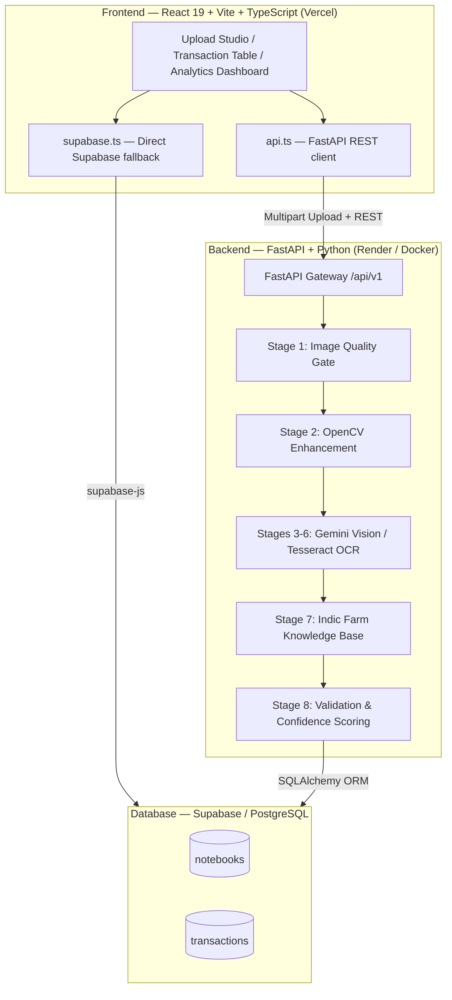

# 🌾 GramIQ AI Ledger Digitization System

[](https://www.python.org/)
[](https://fastapi.tiangolo.com/)
[](https://react.dev/)
[](https://www.typescriptlang.org/)
[](https://supabase.com/)
[](https://ledger-ocr-seven.vercel.app/)
[](https://gramiq-finance-ocr-backend.onrender.com/)
[](LICENSE)

An end-to-end **AI Document Intelligence Platform** purpose-built for Indian agriculture. It converts handwritten, multilingual paper notebooks (**Bahi-Khata**) into structured, machine-readable financial ledgers using computer vision, Indic domain knowledge, vision models, and local OCR.

🌐 **Live Demo**: [ledger-ocr-seven.vercel.app](https://ledger-ocr-seven.vercel.app/)

---

## 🌟 Key Features

- **Multilingual Handwriting Recognition**: Supports mixed Hindi (Devanagari), Marathi, and English handwritten entries on the same page.
- **8-Stage AI Digitization Pipeline**: Image quality gate → OpenCV deskewing & shadow removal → layout parsing → Indic agricultural domain enrichment → arithmetic sanity checks.
- **Indic Farm Knowledge Base**: Native resolution of local product names, aliases, and labor tasks (e.g. *मजुरी*, *निंदणी*, *बियाणे*, *DAP*, *यूरिया*, *नांगरटी*) to standard accounting categories.
- **Confidence-Driven Human Review**: Automatic confidence scoring (`High`, `Medium`, `Low`). High-confidence records are auto-committed; low-confidence entries are flagged for farmer review.
- **Interactive Review Studio**: Intermediate pipeline data viewer lets users inspect OCR output, translations, and AI-parsed results at each stage before committing.
- **Analytics Dashboard**: Recharts-powered P&L, category breakdown, and crop-wise profit/loss visualizations.
- **Dual Data Source**: Frontend queries the FastAPI backend first; falls back to Supabase direct read if the backend is unavailable.

---

## 🏗️ System Architecture



---

## 🚀 Quickstart Guide

### Prerequisites

| Tool | Version |
|------|---------|
| Python | 3.10+ |
| Node.js | 18+ |
| Tesseract OCR | 5.x (optional, fallback OCR) |

---

### Step 1: Clone the Repository

```bash
git clone https://github.com/The-Harsh-Vardhan/Finance-OCR.git
cd Finance-OCR
```

---

### Step 2: Backend Setup

```bash
# Create and activate virtual environment
python -m venv venv

# Windows (PowerShell):
.\venv\Scripts\Activate.ps1
# Linux/macOS:
source venv/bin/activate

# Install dependencies
pip install -r backend/requirements.txt
```

Configure environment variables:
```bash
cp .env.example backend/.env
# Edit backend/.env — set GEMINI_API_KEY, DATABASE_URL, etc.
```

Start the FastAPI server:
```bash
cd backend
python -m uvicorn main:app --reload --port 8000
```

- 🌐 **REST API**: `http://127.0.0.1:8000`
- 📖 **Swagger UI**: `http://127.0.0.1:8000/docs`

---

### Step 3: Frontend Setup

```bash
cd frontend
npm install
```

Create `frontend/.env.local`:
```env
VITE_API_URL=http://localhost:8000
# Optional — connect to your own Supabase project for direct DB access
VITE_SUPABASE_URL=https://<your-project>.supabase.co
VITE_SUPABASE_ANON_KEY=<your-anon-key>
```

Start the dev server:
```bash
npm run dev
```

- 🎨 **Frontend UI**: `http://localhost:5173`

> **Tip**: The API base URL and Supabase credentials can also be set at runtime via the Settings panel in the UI (stored in `localStorage`), so you don't need to rebuild the frontend to switch backends.

---

### Step 4: Supabase Setup (Optional)

If you want Supabase as the primary or fallback database, run the schema migration in your Supabase project's SQL Editor:

```bash
# Paste the contents of supabase/schema.sql into Supabase Dashboard → SQL Editor → Run
```

This creates the `notebooks` and `transactions` tables, indexes, RLS policies, and a storage bucket for uploaded images.

---

## 📂 Project Structure

```
Finance OCR/
├── backend/                          # Python FastAPI backend
│   ├── app/
│   │   ├── api/v1/
│   │   │   ├── endpoints/
│   │   │   │   ├── notebooks.py      # Upload, process, list, delete endpoints
│   │   │   │   ├── transactions.py   # Verify, update, delete endpoints
│   │   │   │   ├── analytics.py      # P&L and category summary endpoint
│   │   │   │   └── knowledge_base.py # Indic KB term search endpoint
│   │   │   └── router.py             # Aggregated v1 API router
│   │   ├── core/
│   │   │   ├── config.py             # App settings & env loader
│   │   │   └── database.py           # SQLAlchemy engine & session
│   │   ├── models/                   # SQLAlchemy ORM models (Notebook, Transaction)
│   │   ├── schemas/                  # Pydantic v2 request/response schemas
│   │   └── services/
│   │       ├── image_processor.py    # OpenCV quality check & enhancement
│   │       ├── farm_knowledge_base.py# Indic domain dictionary & category bounds
│   │       ├── llm_parser.py         # Gemini Vision and Tesseract OCR parser
│   │       ├── validation_engine.py  # Arithmetic & date normalization rules
│   │       └── pipeline_orchestrator.py # 8-stage workflow coordinator
│   ├── tests/                        # Pytest test suite
│   ├── tessdata/                     # Tesseract trained data (hin, mar, eng)
│   ├── uploads/                      # Uploaded & enhanced image storage
│   ├── Dockerfile                    # Docker image for Render deployment
│   ├── main.py                       # FastAPI application entrypoint
│   └── requirements.txt
│
├── frontend/                         # React 19 + Vite + TypeScript SPA
│   ├── src/
│   │   ├── components/
│   │   │   ├── Header.tsx            # Nav bar with backend health indicator & settings
│   │   │   ├── UploadStudio.tsx      # Drag-and-drop image uploader
│   │   │   ├── TransactionTable.tsx  # Editable transaction review grid
│   │   │   ├── IntermediateModal.tsx # Per-stage pipeline data inspector
│   │   │   ├── AnalyticsDashboard.tsx# Recharts P&L & category charts
│   │   │   ├── PipelineDiagram.tsx   # 8-stage pipeline visualization
│   │   │   └── Toast.tsx             # Toast notification system
│   │   ├── services/
│   │   │   ├── api.ts                # FastAPI REST client (primary)
│   │   │   └── supabase.ts           # Supabase JS client (fallback / direct read)
│   │   ├── types/
│   │   │   └── index.ts              # Shared TypeScript interfaces
│   │   ├── App.tsx                   # Root component & view router
│   │   └── main.tsx                  # Vite entrypoint
│   ├── index.html
│   ├── package.json                  # React 19, Recharts, Supabase JS, Lucide
│   ├── vite.config.ts
│   ├── tsconfig.json
│   └── vercel.json                   # Vercel SPA routing config
│
├── supabase/
│   └── schema.sql                    # PostgreSQL schema, indexes, RLS & storage bucket
│
├── docs/                             # Technical design documents & research
├── render.yaml                       # Render.com Docker deployment config
├── vercel.json                       # Root-level Vercel config
├── .env.example                      # Environment variable template
├── .gitignore
├── LICENSE                           # MIT License
└── README.md
```

---

## 📑 API Reference

| Method | Endpoint | Description |
| :--- | :--- | :--- |
| `GET`  | `/` | Health check — returns system & DB status |
| `POST` | `/api/v1/notebooks/upload` | Upload a Bahi-Khata image (`multipart/form-data`) |
| `POST` | `/api/v1/notebooks/process/{id}` | Run the 8-stage AI digitization pipeline |
| `GET`  | `/api/v1/notebooks` | List all uploaded notebooks |
| `GET`  | `/api/v1/notebooks/{id}` | Get a single notebook with metadata |
| `DELETE` | `/api/v1/notebooks/{id}` | Delete a notebook and its transactions |
| `GET`  | `/api/v1/notebooks/{id}/transactions` | Fetch extracted transactions |
| `GET`  | `/api/v1/notebooks/{id}/intermediate-data` | Inspect per-stage pipeline output |
| `PUT`  | `/api/v1/notebooks/{id}/intermediate-data` | Save edited intermediate stage data |
| `POST` | `/api/v1/transactions/verify` | Batch-verify farmer-reviewed transactions |
| `PUT`  | `/api/v1/transactions/{id}` | Update a single transaction |
| `DELETE` | `/api/v1/transactions/{id}` | Delete a single transaction |
| `GET`  | `/api/v1/analytics/summary` | Aggregated P&L, category costs & crop summaries |
| `GET`  | `/api/v1/knowledge-base/search` | Query regional Hindi/Marathi agricultural term mappings |

---

## ☁️ Deployment

### Frontend → Vercel

The React SPA is deployed automatically on push to `main`. The `vercel.json` at the repo root rewrites all routes to `index.html` for SPA navigation.

```
Production URL: https://ledger-ocr-seven.vercel.app/
```

### Backend → Render (Docker)

The FastAPI backend is containerized and deployed via `render.yaml`:

```yaml
# render.yaml (key settings)
dockerContext: ./backend
dockerfilePath: ./backend/Dockerfile
region: singapore
```

```
Production URL: https://gramiq-finance-ocr-backend.onrender.com
```

> **Note**: The Render free tier spins down after inactivity. The first request may take ~30–60 seconds to cold-start. The frontend header shows a live backend health indicator.

---

## 🧪 Running Tests

```bash
cd backend
python -m pytest tests
```

---

## 🔑 Environment Variables

### Backend (`backend/.env`)

| Variable | Required | Description |
|---|---|---|
| `GEMINI_API_KEY` | Optional | Google Gemini Vision API key. Falls back to Tesseract OCR if unset. |
| `DATABASE_URL` | Required | SQLAlchemy DB URL. `sqlite:///./finance_ocr.db` for local, Supabase Postgres for production. |
| `GEMINI_MODELS` | Optional | Comma-separated model priority list (default: `gemini-2.0-flash,...`) |
| `UPLOAD_DIR` | Optional | Directory to store uploaded images (default: `./uploads`) |
| `MAX_UPLOAD_SIZE_MB` | Optional | Max file upload size (default: `15`) |
| `CONFIDENCE_AUTO_APPROVE_THRESHOLD` | Optional | Auto-approve confidence threshold (default: `0.80`) |
| `CORS_ORIGINS` | Required (prod) | Comma-separated list of allowed frontend origins |

### Frontend (`frontend/.env.local`)

| Variable | Required | Description |
|---|---|---|
| `VITE_API_URL` | Optional | FastAPI backend base URL (default: Render production URL) |
| `VITE_SUPABASE_URL` | Optional | Supabase project URL for direct DB access |
| `VITE_SUPABASE_ANON_KEY` | Optional | Supabase anon key |

---

## 📄 License

Distributed under the MIT License. See [`LICENSE`](LICENSE) for details.
